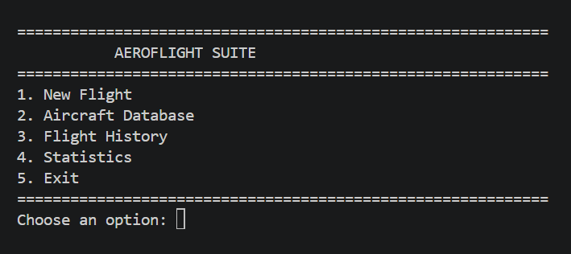
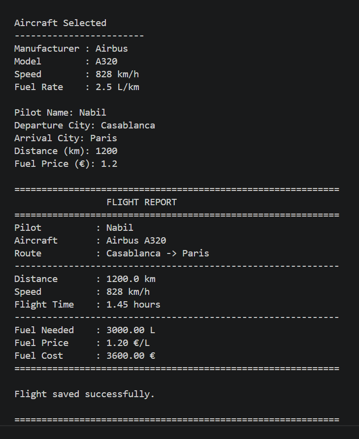
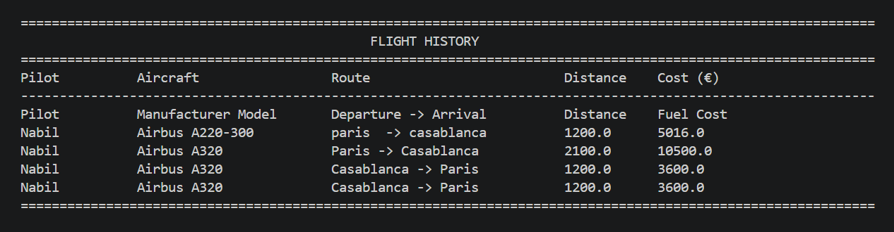
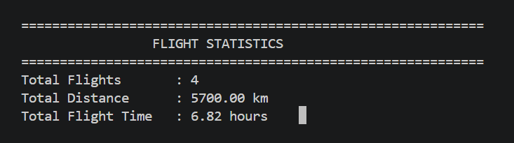

# ✈️ AeroFlight Suite

   

> 🚀 This project is part of my Software Engineering & AI portfolio.

### Professional Flight Management System developed with Python

AeroFlight Suite is a Python-based application designed to simulate and manage flight operations through a clean and modular architecture.

The application enables users to:

- Create and manage flight records.
- Select aircraft from an integrated database.
- Calculate flight duration.
- Estimate fuel consumption.
- Calculate fuel costs.
- Store flight reports in CSV format.
- View flight history.
- Display flight statistics.
- Search aircraft by manufacturer or model.

---

## 📷 Screenshots

### Main Menu



---

### New Flight



---

### Flight History



---

### Statistics



---

## ✨ Features

- ✔ Aircraft Database
- ✔ Flight Calculator
- ✔ Fuel Consumption Calculator
- ✔ Fuel Cost Estimation
- ✔ Flight Reports
- ✔ Flight History
- ✔ Flight Statistics
- ✔ Aircraft Search
- ✔ Input Validation

---

## 🛠 Technologies

- Python 3
- Object-Oriented Programming (OOP)
- Modular Programming
- CSV Database
- Git
- GitHub

---

## 📂 Project Structure

```text
AeroFlightSuite/

├── data/
│   └── flights.csv
│
├── screenshots/
│
├── aircraft_data.py
├── calculator.py
├── database.py
├── file_manager.py
├── flight.py
├── flight_model.py
├── history.py
├── main.py
├── menu.py
├── statistics.py
├── validation.py
│
├── README.md
├── requirements.txt
├── LICENSE
└── .gitignore
```

---

## 🚀 Installation

Clone the repository:

```bash
git clone https://github.com/nabil-engineer/AeroFlightSuite.git
```

Go to the project folder:

```bash
cd AeroFlightSuite
```

---

## ▶️ How to Run

Run the application:

```bash
python main.py
```

---

## 🚀 Future Improvements

- Professional Graphical User Interface (GUI)
- Web Version (Flask)
- SQLite Database
- REST API
- Airport Database
- Weather Integration
- PDF Flight Reports
- AI Flight Assistant
- Flight Data Analysis

---

## 🗺️ Project Roadmap

### ✅ Version 1.0 — Flight Management System

- Aircraft Database
- Flight Creation
- Flight History
- Flight Statistics
- Fuel Consumption Calculator
- Fuel Cost Estimation
- CSV Storage

---

### 🔄 Version 2.0 — Flight Planner

- Flight Number
- Flight Date
- Departure Airport
- Arrival Airport
- Route Information
- Automatic Distance Calculation

---

### 🔄 Version 3.0 — Database Upgrade

- SQLite Database
- Advanced Search
- Flight Filtering
- Data Management

---

### 🔄 Version 4.0 — Professional GUI

- Tkinter Interface
- Dashboard
- Charts
- Better User Experience

---

### 🔄 Version 5.0 — Web Application

- Flask
- Responsive Interface
- REST API
- User Authentication

---

### 🔄 Version 6.0 — Aviation Services

- Weather Integration
- Airport Database
- PDF Flight Reports
- Interactive Maps

---

### 🔄 Version 7.0 — Artificial Intelligence

- AI Flight Assistant
- Fuel Consumption Prediction
- Route Optimization
- Flight Data Analysis

---

## 👨‍💻 Author

**Nabil Elouizi**

Software Engineering Student

Python Developer

AI & Aerospace Enthusiast

🌐 Portfolio:
https://nabil-engineer.github.io/nabil-portfolio/

💻 GitHub:
https://github.com/nabil-engineer

---

## 📄 License

This project is licensed under the MIT License.