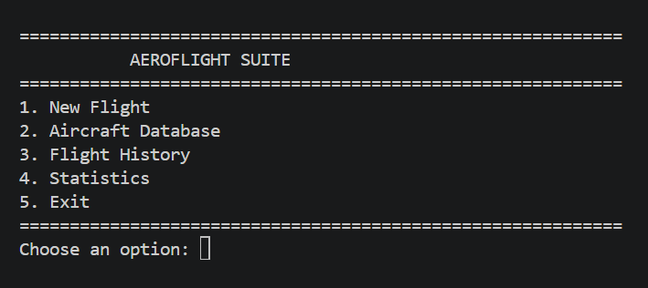
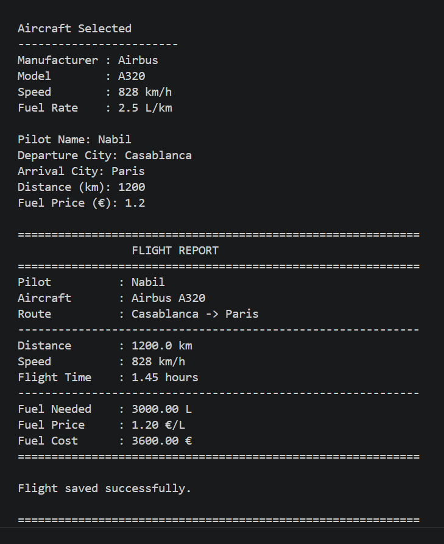
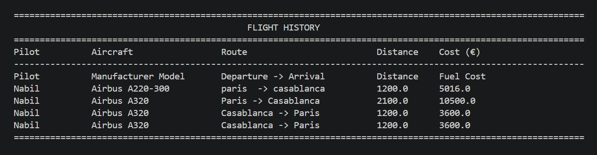
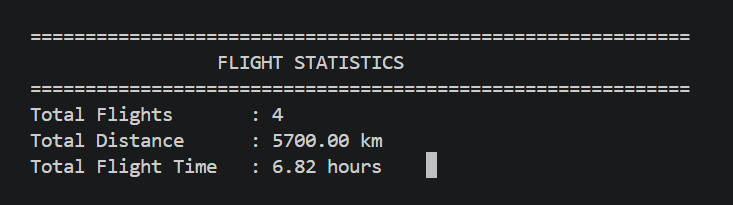

# ✈️ AeroFlight Suite

   

> 🚀 This project is part of my Software Engineering & AI portfolio.

### Professional Flight Management System developed with Python

AeroFlight Suite is a professional Python-based flight management system designed to simulate and manage flight operations through a clean, modular, and maintainable architecture.

The system integrates flight management, aircraft and airport databases, route calculation, fuel analysis, weather intelligence, runway reference data, runway performance analysis, flight search, filtering, sorting, statistics, and SQLite persistence.

The application enables users to:

- Create and manage flight records.
- Select aircraft from an integrated aircraft database.
- Select departure and arrival airports.
- Calculate automatic route distance using the Haversine formula.
- Calculate flight duration.
- Estimate fuel consumption.
- Calculate fuel costs.
- Analyze weather conditions and their impact on flights.
- Calculate weather severity and weather factors.
- Analyze runway takeoff and landing performance, margins, and sufficiency.
- Store flight records in a SQLite database.
- Persist runway performance results.
- Search and filter stored flights.
- Perform advanced flight searches.
- Sort flight records.
- Manage flight statuses.
- Update flight weather, cost, and distance information.
- Delete flight records.
- View flight history.
- Display flight statistics.
- Generate professional flight reports.
- Search aircraft by manufacturer or model.
- Search airports by IATA code or city.
- Manage runway reference data.
- Create safe SQLite database backups.
- Maintain compatibility with previous application versions.

---

## 📷 Screenshots

### Main Menu



---

### New Flight



---

### Flight History



---

### Statistics



---

## ✨ Features

✈️ Flight Management

- ✔ Flight Creation
- ✔ Flight History
- ✔ Flight Statistics
- ✔ Flight Search
- ✔ Advanced Flight Search
- ✔ Flight Filtering
- ✔ Flight Sorting
- ✔ Flight Status Management
- ✔ Flight Deletion
- ✔ Flight Updates
- ✔ Professional Flight Reports

🛫 Aircraft & Airport Database

- ✔ Aircraft Database
- ✔ Aircraft Search
- ✔ Airport Database
- ✔ Airport Search
- ✔ Search by IATA Code
- ✔ Search by City
- ✔ Manufacturer & Aircraft Model Information

🛬 Runway Performance

- ✔ Runway Reference Data Synchronization
- ✔ Runway Selection by Airport
- ✔ Runway Length
- ✔ Runway Surface
- ✔ Airport Elevation
- ✔ Aircraft Reference Weight
- ✔ Actual Aircraft Weight
- ✔ Required Takeoff Distance
- ✔ Required Landing Distance
- ✔ Takeoff Margin
- ✔ Landing Margin
- ✔ Takeoff Sufficiency Status
- ✔ Landing Sufficiency Status
- ✔ Runway Performance Persistence
- ✔ Runway Performance Retrieval
- ✔ Runway Performance Deletion with Flight Deletion
- ✔ Optional Runway Performance for Legacy-Compatible Flights

🗺️ Route & Flight Calculations

- ✔ Automatic Route Distance Calculation
- ✔ Haversine Distance Calculation
- ✔ Flight Duration Calculation
- ✔ Aircraft Speed Integration
- ✔ Fuel Consumption Calculation
- ✔ Fuel Cost Calculation
- ✔ Fuel Price Management

🌦️ Weather Intelligence

- ✔ Weather Data Integration
- ✔ Weather Condition Analysis
- ✔ Weather Severity Analysis
- ✔ Weather Impact on Fuel Consumption
- ✔ Weather Factor Calculation
- ✔ Wind Speed & Direction
- ✔ Temperature
- ✔ Pressure
- ✔ Humidity
- ✔ Visibility

🗄️ Database & Data Management

- ✔ SQLite Database
- ✔ Centralized Database Connection Management
- ✔ Database Schema Migration
- ✔ Database Indexing
- ✔ CRUD Operations
- ✔ Safe SQLite Database Backups
- ✔ Absolute Database Paths
- ✔ Absolute Backup Paths
- ✔ SQLite Native Backup API
- ✔ Legacy Data Compatibility
- ✔ Runway Reference Data Synchronization
- ✔ Runway Performance Persistence

🔎 Search & Filtering

- ✔ Standard Flight Search
- ✔ Advanced Flight Search
- ✔ Departure Filtering
- ✔ Arrival Filtering
- ✔ Aircraft Filtering
- ✔ Distance Filtering
- ✔ Weather Factor Filtering
- ✔ Flight Sorting

🛡️ Reliability

- ✔ Input Validation
- ✔ Centralized Error Handling
- ✔ Database Error Handling
- ✔ Versioned Database Migrations
- ✔ Modular Architecture
- ✔ Python Compilation Checks
- ✔ Testing Infrastructure
- ✔ V4/V5 Compatibility Testing
- ✔ Runway Performance Persistence Testing
- ✔ Runway Performance Deletion Testing

---

## 🛠 Technologies

- Python 3.13
- SQLite3
- Python Standard Library
- Object-Oriented Programming (OOP)
- Modular Architecture
- Layered Database Architecture
- SQLite Online Backup API
- Haversine Formula
- Git
- GitHub

---

## 📂 Project Structure

AeroFlightSuite/
│
├── config/
│   └── config.py
│
├── core/
│   ├── catalog.py
│   ├── flight.py
│   ├── history.py
│   ├── menu.py
│   └── statistics.py
│
├── data/
│   ├── aircraft_data.py
│   ├── airport_data.py
│   └── runway_data.py
│
├── database/
│   ├── __init__.py
│   ├── backup_manager.py
│   ├── common.py
│   ├── create_queries.py
│   ├── delete_queries.py
│   ├── read_queries.py
│   ├── update_queries.py
│   ├── database_manager.py
│   └── aeroflight.db
│
├── managers/
│   ├── delete_manager.py
│   ├── flight_manager.py
│   ├── flight_repository.py
│   ├── runway_repository.py
│   ├── search_manager.py
│   └── status_manager.py
│
├── models/
│   ├── flight_model.py
│   ├── runway_model.py
│   └── weather_model.py
│
├── services/
│   ├── flight_service.py
│   ├── runway_service.py
│   └── weather_service.py
│
├── utils/
│   ├── calculator.py
│   ├── display.py
│   ├── error_handler.py
│   ├── logger.py
│   ├── route_calculator.py
│   └── validation.py
│
├── screenshots/
│   ├── aircraft-database.png
│   ├── airport-database.png
│   ├── history.png
│   ├── main-menu.png
│   ├── new-flight.png
│   └── statistics.png
│
├── backups/
│
├── logs/
│
├── main.py
├── README.md
├── LICENSE
├── requirements.txt
└── .gitignore


## 🚀 Installation

Clone the repository:

```bash
git clone https://github.com/nabil-engineer/AeroFlightSuite.git
```

Go to the project folder:

```bash
cd AeroFlightSuite
```

Create a virtual environment (optional):

```bash
python -m venv venv
```

Activate it:

**Windows**

```bash
venv\Scripts\activate
```

**Linux / macOS**

```bash
source venv/bin/activate
```

Install dependencies:

```bash
pip install -r requirements.txt
```

## ▶️ How to Run

Run the application from the project directory:

```bash
python main.py
```

---

## 🚀 Future Improvements

- Professional Graphical User Interface (Tkinter)
- Interactive Dashboard
- Icons & Images
- Charts & Analytics
- Export Flight Reports to PDF
- Export Flight Data to Excel
- Web Version (Flask)
- User Authentication & Login System
- REST API
- External Weather API Integration
- Interactive Airport Maps
- Docker Deployment
- AI Flight Assistant
- Fuel Consumption Prediction
- Intelligent Route Optimization
- Advanced Flight Data Analysis
- Machine Learning Integration

---

## 🗺️ Project Roadmap

### ✅ Version 1.0 — Flight Management System

- Aircraft Database
- Flight Creation
- Flight History
- Flight Statistics
- Fuel Consumption Calculator
- Fuel Cost Calculation
- CSV Storage (Legacy)

---

### ✅ Version 2.0 — Flight Planner

- Airport Database
- Automatic Route Distance Calculation
- Flight Number & Flight Date
- Flight Status Management
- Flight Search
- Flight Deletion
- Aircraft Search
- Airport Search
- Modular Project Architecture

---

### ✅ Version 3.0 — Professional Database System

- SQLite Database Integration
- Complete CRUD System (Create, Read, Update, Delete)
- Advanced Flight Search
- Flight Filtering
- Flight Sorting
- Database Backup
- Data Validation Improvements

---

### ✅ Version 4.0 — Weather Intelligence & Professional Flight Management

- Weather Model
- Weather Severity Analysis
- Weather Impact on Fuel Consumption
- Weather Factor Calculation
- Wind Speed & Direction Analysis
- Temperature, Pressure & Humidity Data
- Visibility Analysis
- Professional Flight Reports
- Advanced Flight Search
- Flight Filtering & Sorting
- Aircraft & Airport Search
- Flight Status Management
- Flight Update Operations
- Database Schema Migration
- Database Indexing
- Centralized Database Connection
- Absolute Database & Backup Paths
- SQLite Native Backup API
- Improved Modular Architecture
- Legacy Data Compatibility

---

### ✅ Version 5.0 — Runway Performance

#### Runway Performance

- Runway Reference Data
- Runway Selection by Airport
- Required Takeoff Distance
- Required Landing Distance
- Airport Elevation
- Runway Length
- Runway Surface
- Aircraft Reference Weight
- Actual Aircraft Weight
- Takeoff & Landing Margins
- Takeoff & Landing Sufficiency Analysis
- Performance Persistence
- Optional Runway Performance for Legacy-Compatible Flights

#### Database Improvements
- Schema Version 5
- Version 5 Migration
- Runway Reference Data Synchronization
- Runway Performance Database Table
- Persistent `flight_runway_performance` Records
- Safe Performance Cleanup on Flight Deletion

---

### 🔄 Version 6.0 — Professional Desktop GUI

- Professional Tkinter Desktop Interface
- Dashboard & Navigation System
- Flight, Aircraft & Airport Management
- Runway Performance & Weather Interfaces
- Flight History, Search & Filtering
- Interactive Forms & Data Tables
- Input Validation & Error Handling
- Flight, Fuel & Performance Analytics
- Charts & Data Visualization
- GUI Integration with Existing Architecture
- Reuse of Existing Models, Services & Database
- CLI Compatibility

---

### 🔄 Version 7.0 — Aircraft Maintenance + Web Application

#### Aircraft Maintenance
- Aircraft Maintenance Records
- Maintenance Schedule
- Engine Hours
- Maintenance Alerts
- Maintenance History
- Maintenance Status Tracking

#### Web Application
- Flask Web Application
- Responsive Interface
- User Authentication
- REST API
- Web-based Flight Management

---

### 🔄 Version 8.0 — Airport Management + Aviation Services

#### Airport Management
- Gates
- Flights
- Aircraft Parking
- Runways
- Airport Operations

#### Aviation Services
- Weather API Integration
- Interactive Airport Maps
- PDF Flight Reports
- Excel Export
- Aviation Data Services

---

### 🔄 Version 9.0 — Flight Analytics

- Flight Analytics
- Charts & Statistics
- Fuel Analysis
- Monthly Reports
- Performance Analysis
- Dashboard Analytics

---

### 🔄 Version 10.0 — Advanced Web Application & Artificial Intelligence

#### Advanced Web Platform

- Advanced Flask Architecture
- Advanced REST API
- User & Role Management
- Advanced Flight Management
- Web-based Analytics
- Real-time Flight Data
- Advanced Database Architecture
- Web-based Dashboard
- Flight & Aircraft Management
- Airport & Runway Management

#### Artificial Intelligence

- AI Flight Assistant
- Fuel Consumption Prediction
- Intelligent Route Optimization
- Flight Data Analysis
- Predictive Maintenance
- Flight Performance Prediction
- Machine Learning Integration
- Intelligent Aviation Decision Support

---

## 👨‍💻 Author

**Nabil Elouizi**

Software Engineering Student

Python Developer

AI & Aerospace Enthusiast

🌐 Portfolio:
<https://nabil-engineer.github.io/nabil-portfolio/>

💻 GitHub:
<https://github.com/nabil-engineer>

---

## 📄 License

This project is licensed under the MIT License.